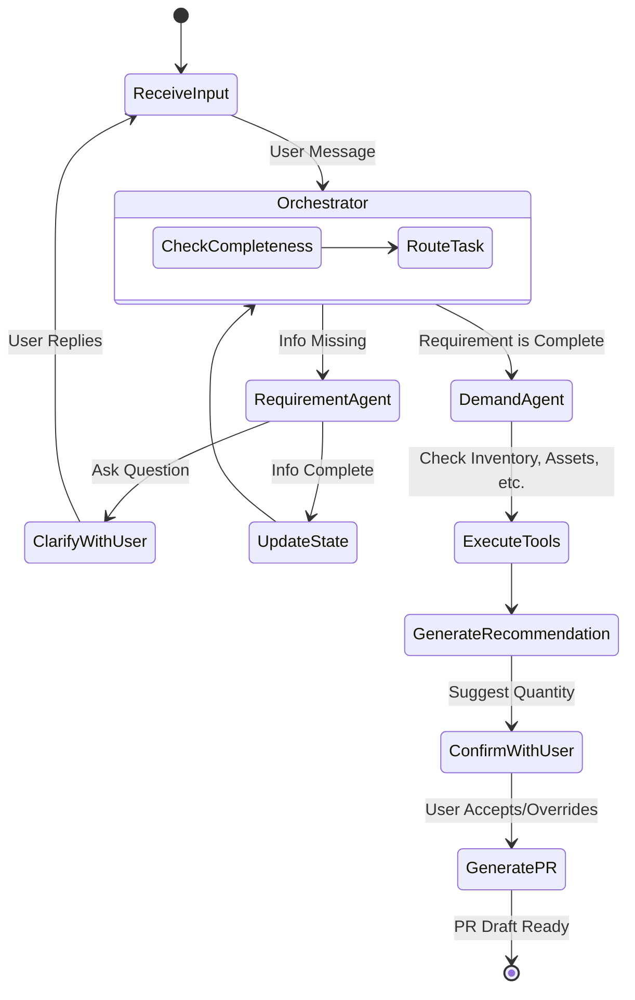
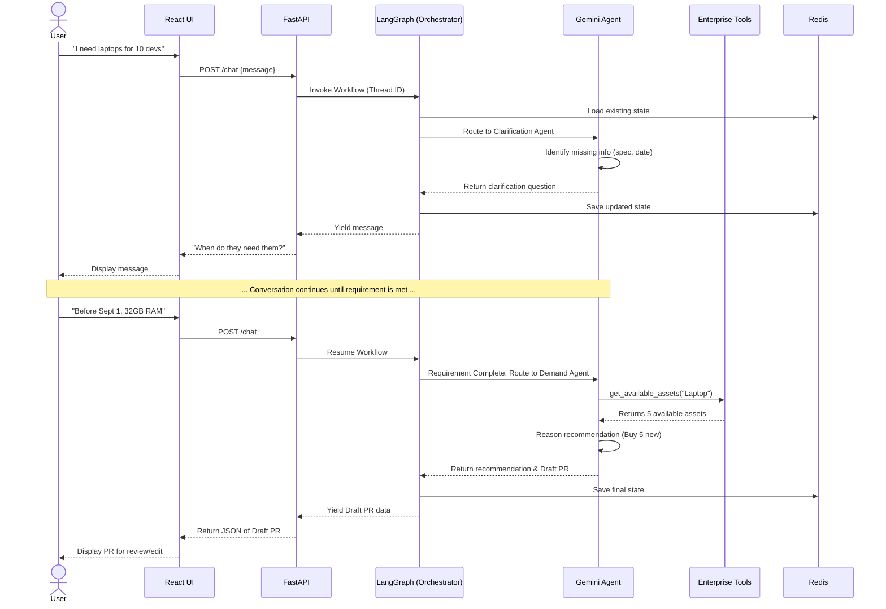

# System Architecture Document (SAD)

# ProcureAI

**Document Status:** Draft
**Version:** 1.0
**Related Document:** [01-PRD.md](01-PRD.md)

---

## 1. Overview

This document outlines the system architecture for the **ProcureAI**, an Agentic AI system designed to assist users in transforming unstructured purchasing needs into structured Purchase Requisitions (PR). 

The architecture is designed to support conversational interactions, multi-agent workflows for requirement clarification and demand analysis, and integration with organizational data tools.

---

## 2. Technology Stack

The system is built upon a modern, scalable technology stack separated into distinct layers:

| Layer | Technology | Purpose |
| :--- | :--- | :--- |
| **Frontend (UI)** | **React** | User interface for conversational chat, requirement confirmation, and PR draft review. |
| **Backend (API)** | **FastAPI** | High-performance API gateway handling client requests, routing, and serving as the primary backend framework. |
| **AI & Agent Orchestration** | **LangChain & LangGraph** | Framework for defining agent behaviors, tool integrations (LangChain), and stateful multi-agent workflows (LangGraph). |
| **LLM Engine** | **Google Gemini** | The core Large Language Model providing natural language understanding, reasoning, and extraction capabilities. |
| **State & Memory** | **Redis** | In-memory datastore for managing real-time conversation history (short-term memory) and LangGraph agent state transitions. |
| **Database** | **PostgreSQL** | Persistent relational database for storing user data, finalized PR drafts, audit logs, and tool mock data/cache. |

---

## 3. High-Level Architecture Diagram

```mermaid
graph TD
    %% Users
    User((User))

    %% Frontend
    subgraph Frontend [Client Layer]
        ReactUI[React Web App\nChat Interface & PR Review]
    end

    %% API Layer
    subgraph APILayer [API Gateway Layer]
        FastAPI[FastAPI Server\nRouting & Auth]
    end

    %% Agent Layer
    subgraph AgentLayer [AI Agentic Layer - LangGraph]
        Orchestrator[Orchestrator Node\nState Manager]
        ReqAgent[Requirement Clarification Agent\nGemini + LangChain]
        DemandAgent[Demand Analysis Agent\nGemini + LangChain]
    end

    %% Data & State
    subgraph Storage [Data & State Layer]
        Redis[(Redis)\nConversation State & Memory]
        Postgres[(PostgreSQL)\nAudit Logs & PR Drafts]
    end

    %% External Tools
    subgraph EnterpriseData [Enterprise Tools/Mocks]
        InventoryTool[Inventory API]
        AssetTool[Asset API]
        PolicyTool[Policy API]
    end

    %% Connections
    User <-->|HTTP/WS| ReactUI
    ReactUI <-->|REST / WebSockets| FastAPI
    
    FastAPI <-->|Trigger Workflow| Orchestrator
    FastAPI <-->|Read/Write| Postgres
    
    Orchestrator <-->|Save/Load State| Redis
    Orchestrator --> ReqAgent
    Orchestrator --> DemandAgent
    
    ReqAgent -->|Invoke Tools| EnterpriseData
    DemandAgent -->|Invoke Tools| EnterpriseData
```

---

## 4. Core Component Description

### 4.1 Frontend Layer (React)
- Provides a conversational chat interface for users to input their natural language requests.
- Renders structured forms dynamically when user confirmation is needed (e.g., confirming extracted requirements or reviewing the final PR draft).
- Communicates with the backend via REST APIs (or WebSockets for real-time typing indicators/streaming).

### 4.2 API Layer (FastAPI)
- Acts as the entry point for all frontend requests.
- Handles authentication and user authorization.
- Initializes and triggers the LangGraph workflows based on user input.
- Formats and sanitizes outputs before sending them back to the client.

### 4.3 AI & Agentic Layer (LangChain, LangGraph, Gemini)
This is the core intelligence of the application.
- **Google Gemini:** Serves as the reasoning engine for the agents. It processes context, decides which tools to call, and formulates conversational responses.
- **LangChain:** Used to define the individual agents (Requirement Clarification and Demand Analysis), bind tools to the LLM, and handle output parsing (extracting structured JSON from Gemini's response).
- **LangGraph:** Orchestrates the multi-agent workflow as a state machine. It manages the routing between the Orchestrator, the Clarification Agent, and the Demand Agent. LangGraph ensures the system can pause execution to wait for user input (Human-in-the-loop) and resume seamlessly.

### 4.4 State & Memory Management (Redis)
- **LangGraph Checkpointer:** Redis is used as the state saver (checkpointer) for LangGraph. This allows the conversation to be paused (e.g., waiting for the user to confirm a requirement) and resumed later without losing the context of the workflow.
- **Conversation History:** Stores the raw chat history for fast retrieval during active sessions.

### 4.5 Data Persistence (PostgreSQL)
- **PR Drafts:** Stores the generated, structured Purchase Requisition drafts before they are officially submitted to the ERP.
- **Audit Logs:** Maintains a deterministic log of user requests, AI recommendations, tool invocations, and user overrides for compliance (as specified in PRD NFRs).

---

## 5. Agent State Workflow (LangGraph Concept)

The system operates as a cyclical graph where the state is continuously updated until the PR is ready.



---

## 6. Sequence Diagram: E2E User Flow



---

## 7. Security & Data Flow Boundaries

*   **Deterministic Data:** All organizational data (inventory, budget, policies) must flow exclusively through predefined Tools (API endpoints). The LLM (Gemini) must not be allowed to hallucinate this data.
*   **Authorization:** FastAPI will inject user context (e.g., `user_department`, `user_id`) into the LangGraph state. Tools invoked by the agents will use this context to ensure the user only retrieves data they are authorized to see.
*   **Prompt Injection:** User inputs will be sanitized by FastAPI before being passed into the LangGraph state to mitigate prompt injection attacks.
