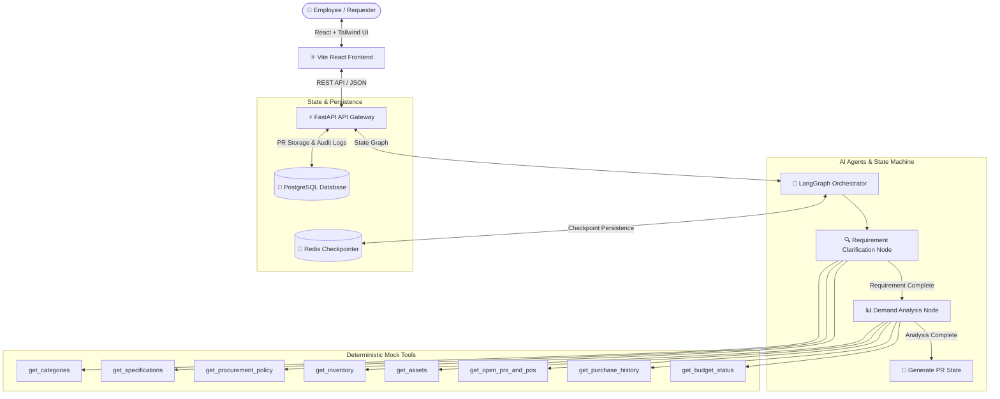

# 🛒 ProcureAI — Agentic AI Procurement Copilot 🤖

[](https://www.python.org/)
[](https://fastapi.tiangolo.com/)
[](https://langchain-ai.github.io/langgraph/)
[](https://react.dev/)
[](https://tailwindcss.com/)
[](https://www.postgresql.org/)
[](https://redis.io/)
[-brightgreen.svg?style=flat)]()

**ProcureAI** is an enterprise-grade **Agentic AI Copilot** designed to help employees transform unstructured purchasing needs into structured, validated, and justified Purchase Requisitions (PR).

---

## 🌟 Key Capabilities

1. **Multi-Turn Requirement Clarification Agent:**
   - Understands natural language requests for arbitrary enterprise goods (IT hardware, ergonomic office furniture, software licenses, etc.).
   - Dynamically identifies standard categories and queries specifications without hallucination.
   - Asks targeted clarification questions for missing data (quantity, technical specifications, required date, business justification).

2. **Deterministic Demand Analysis Agent:**
   - Zero hallucination: connects directly to enterprise tools (`get_inventory`, `get_assets`, `get_open_prs_and_pos`, `get_purchase_history`, `get_budget_status`).
   - Automatically cross-references warehouse inventory, unallocated assets, returning hardware, and active pipeline orders.
   - Calculates exact net demand to prevent duplicate/unnecessary enterprise spending.

3. **Human-in-the-Loop (HITL) State Machine:**
   - Powered by **LangGraph** with **Redis Checkpointer** for multi-turn state persistence and session isolation.
   - Interactive in-chat cards allow live inline edits to requirement drafts.
   - Demand analysis review card allows users to accept recommended quantities or override with business justification.
   - Full PR Draft review modal with live field editing, JSON preview, copy summary, and final requisition submission.

4. **Enterprise Guardrails & Policy Enforcement:**
   - **Out-of-Scope Guardrails:** Strictly restricts AI from vendor sourcing, RFQ generation, external price comparison, or price negotiations (reserved for Procurement specialists).
   - **Policy Guardrails:** Informs users of approval workflows and spending thresholds (e.g. Finance Director approval required for orders over $5,000).

---

## 🏗️ System Architecture



---

## 📁 Repository Structure

```
procure-ai-v2/
├── backend/                  # FastAPI & LangGraph Backend
│   ├── app/
│   │   ├── agent/            # LangGraph nodes, state schemas, and graph orchestration
│   │   ├── api/              # FastAPI routes (v1/chat, auth/me, deps)
│   │   ├── core/             # Configuration & environment settings
│   │   ├── db/               # PostgreSQL session & Redis checkpointer helpers
│   │   ├── eval/             # LLM-as-a-judge evaluation dataset & runner
│   │   ├── models/           # SQLAlchemy database models (AuditLog, PR)
│   │   ├── schemas/          # Pydantic request/response schemas
│   │   └── tools/            # Deterministic mock enterprise tools
│   ├── alembic/              # Database migration scripts
│   ├── tests/                # 14 Pytest test suites (67 tests, 100% pass)
│   ├── pyproject.toml        # uv package configuration
│   └── main.py               # FastAPI application entrypoint
├── frontend/                 # React (Vite + TypeScript) Frontend
│   ├── src/
│   │   ├── api/              # Axios API clients & chat endpoint bindings
│   │   ├── components/       # ChatWindow, Navbar, Cards, Modal, Bubble
│   │   ├── types/            # TypeScript interfaces for Chat, PR, Demand
│   │   ├── App.tsx           # Main application state & HITL handlers
│   │   └── index.css         # TailwindCSS design system & custom styles
│   ├── package.json
│   └── vite.config.ts
├── docker-compose.yml        # PostgreSQL & Redis infrastructure
├── .docs/                    # System Documentation & Specifications
│   ├── 01-PRD.md             # Product Requirements Document
│   ├── 02-System-Architecture.md
│   ├── 03-Agent-Design.md    # Agent System Prompts & Schemas
│   ├── 04-Tools-API.md       # Tool Contracts & Schemas
│   └── 05-Test-Plan.md       # Golden Dataset & Evaluation Methodology
└── .dev/                     # Task Breakdown & Progress Tracking
    ├── Task-Breakdown.md
    └── Progress-Tracking.md
```

---

## 🚀 Quick Start Guide

### 1. Prerequisites
- [Docker](https://www.docker.com/) & Docker Compose
- [uv](https://docs.astral.sh/uv/) (Python package manager)
- [Node.js](https://nodejs.org/) (v18+) & npm

### 2. Start Infrastructure (PostgreSQL & Redis)
```bash
docker compose up -d
```

### 3. Setup & Start Backend
```bash
cd backend

# Install dependencies using uv
uv sync

# Configure environment variables
cp .env.example .env
# (Optional) Add your GEMINI_API_KEY in backend/.env for live LLM responses

# Run database migrations
uv run alembic upgrade head

# Start FastAPI development server
uv run uvicorn main:app --reload --port 8000
```
API Documentation will be available at: [http://localhost:8000/docs](http://localhost:8000/docs)

### 4. Setup & Start Frontend
```bash
cd frontend

# Install dependencies
npm install

# Start Vite dev server
npm run dev
```
Web Application will be available at: [http://localhost:5173](http://localhost:5173)

---

## ⚡ Makefile Shortcuts

For convenience, a [Makefile](file:///home/pras-ai/procure-ai-v2/Makefile) is provided for common tasks:

| Command | Description |
| :--- | :--- |
| `make help` | Show all available Make commands |
| `make install` | Install all dependencies (`uv sync` for backend & `npm install` for frontend) |
| `make up` | Start PostgreSQL & Redis in the background via Docker |
| `make down` | Stop Docker infrastructure containers |
| `make migrate` | Apply database migrations via Alembic |
| `make dev-backend` | Start FastAPI development server on port 8000 |
| `make dev-frontend` | Start Vite React dev server on port 5173 |
| `make test` | Run full backend unit test suite (`pytest`) |
| `make eval` | Run Golden Dataset & LLM-as-a-Judge evaluation suite |
| `make check` | Run unit tests and verify frontend production build |
| `make clean` | Clean cache and temporary build files |

---

## 🧪 Testing & Evaluation

### Run Unit Tests (Backend)
All mock tools, API endpoints, LangGraph routing, state reducers, and edge cases are covered by automated unit tests:
```bash
cd backend
uv run pytest
```
*Result: **67/67 passed in ~1.5 seconds (100% pass rate)**.*

### Run LLM-as-a-Judge Evaluation Suite
Evaluates the **5 Golden Dataset Scenarios** (Happy Path, Ambiguity, Inventory Deduction, Vendor Guardrails, and Spending Policies):
```bash
cd backend
uv run python -m app.eval.run_eval
```

---

## 👥 Contributors & Documentation
- **Product Requirements:** [.docs/01-PRD.md](file:///home/pras-ai/procure-ai-v2/.docs/01-PRD.md)
- **Architecture Details:** [.docs/02-System-Architecture.md](file:///home/pras-ai/procure-ai-v2/.docs/02-System-Architecture.md)
