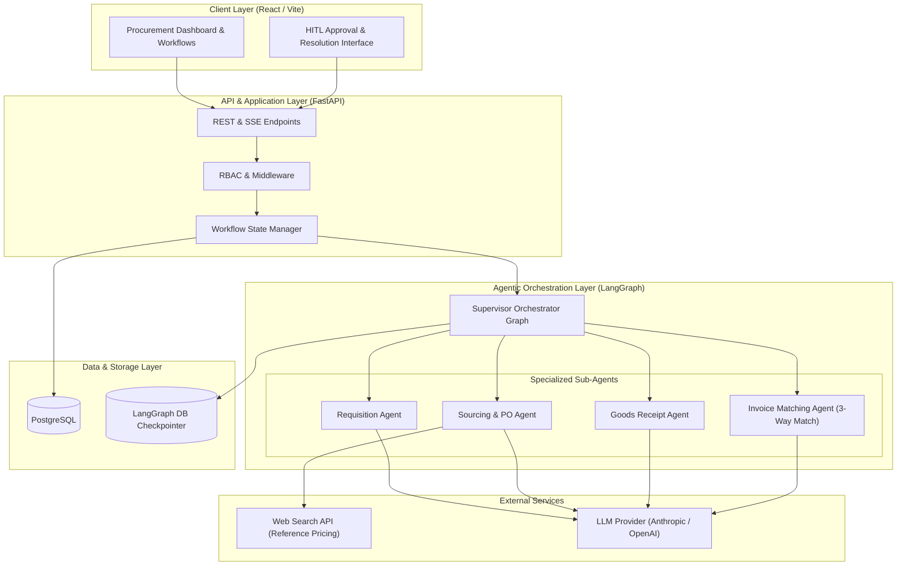
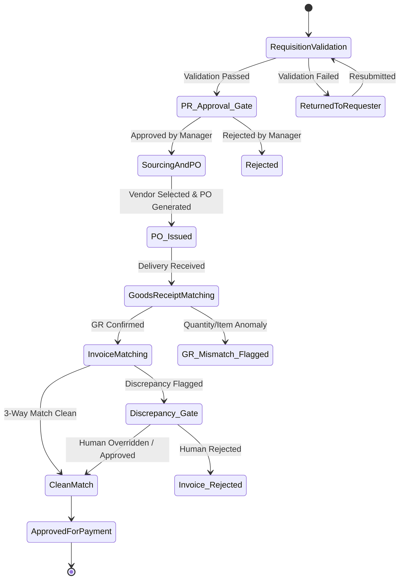

# ProcureAI — System Architecture & Technical Design

**Document Version:** 1.0.0  
**Status:** Approved  
**Author:** Architecture Lead  
**Target Stack:** Python 3.12, LangGraph, FastAPI, Async SQLAlchemy, PostgreSQL, React (Vite)

---

## 1. Executive Summary

ProcureAI is an enterprise-grade agentic procurement platform engineered to automate and govern the end-to-end purchasing lifecycle: **Purchase Requisition (PR) → Purchase Order (PO) → Goods Receipt (GR) → 3-Way Invoice Matching**.

The system utilizes an **Orchestrator-Worker Architecture** built on **LangGraph**. A central Supervisor Graph manages state transitions, enforces human-in-the-loop (HITL) governance gates, and delegates domain-specific logic to specialized sub-agents. The centerpiece of the platform is the **Invoice Matching Agent**, which performs intelligent 3-way reconciliation (PO vs. GR vs. Invoice), detects anomalies with granular classification, and outputs structured, explainable reasoning for human auditability.

---

## 2. High-Level Architecture

The platform follows a layered, decoupled architecture comprising a React SPA frontend, a FastAPI asynchronous backend, a LangGraph agentic workflow engine, and a PostgreSQL relational store.



---

## 3. LangGraph Orchestrator & State Machine Design

### 3.1 State Graph Topology

The procurement lifecycle is modeled as a state machine where state transitions are persisted transactionally via LangGraph's PostgreSQL Checkpointer.



### 3.2 Workflow State Schema (`ProcurementState`)

The orchestrator passes a typed state payload across all graph nodes:

```python
from typing import TypedDict, Optional, List, Dict, Any
from enum import Enum

class ProcurementStage(str, Enum):
    REQUISITION = "requisition"
    PR_APPROVAL_PENDING = "pr_approval_pending"
    SOURCING_PO = "sourcing_po"
    GOODS_RECEIPT = "goods_receipt"
    INVOICE_MATCHING = "invoice_matching"
    DISCREPANCY_REVIEW = "discrepancy_review"
    APPROVED_FOR_PAYMENT = "approved_for_payment"
    REJECTED = "rejected"

class ProcurementState(TypedDict):
    # Lifecycle Identifiers
    pr_id: str
    po_id: Optional[str]
    gr_ids: List[str]
    invoice_id: Optional[str]
    
    # Current Pipeline Stage & Status
    current_stage: ProcurementStage
    status: str
    
    # Stage Data Payload
    pr_data: Dict[str, Any]
    po_data: Optional[Dict[str, Any]]
    gr_data: List[Dict[str, Any]]
    invoice_data: Optional[Dict[str, Any]]
    
    # Agent Reasoning & Evaluation Artifacts
    validation_results: Optional[Dict[str, Any]]
    sourcing_recommendations: Optional[List[Dict[str, Any]]]
    match_results: Optional[Dict[str, Any]]
    
    # Governance & HITL Flags
    requires_human_approval: bool
    approval_type: Optional[str]  # "PR_APPROVAL" | "DISCREPANCY_RESOLUTION"
    human_decision: Optional[Dict[str, Any]]
    
    # Graph Control Metadata
    error: Optional[str]
    history: List[Dict[str, Any]]
```

### 3.3 Human-in-the-Loop (HITL) Mechanism

LangGraph `interrupt` directives pause graph execution at predefined decision gates:

1. **PR → PO Gate (`PR_APPROVAL_PENDING`):**
   * Triggered after the Requisition Agent validates budget & pricing rules.
   * State is saved to DB checkpointer.
   * Resumed via API POST `/api/v1/approvals/pr/{pr_id}` containing human decision (`APPROVE` | `REJECT` + notes).

2. **Invoice Discrepancy Gate (`DISCREPANCY_REVIEW`):**
   * Triggered when the Invoice Matching Agent detects severity > `THRESHOLD` (e.g., price variance > 2% or missing GR).
   * Graph halts; invoice status set to `NEEDS_HUMAN_REVIEW`.
   * Resumed via API POST `/api/v1/approvals/invoice-discrepancy/{invoice_id}` with resolution override (`FORCE_APPROVE`, `REJECT_INVOICE`, `REQUEST_REVISED_INVOICE`).

---

## 4. Agent Architecture & Specifications

### 4.1 Requisition Agent
* **Responsibility:** Validates PR field completeness, budget availability, and flags initial pricing anomalies against historical PR records.
* **Mechanism:** Hybrid rule-based validation + LLM anomaly detector for unstructured item descriptions.
* **Output:** Structed validation payload (`isValid: bool`, `flags: List[AnomalyFlag]`, `budgetStatus: "SUFFICIENT" | "EXCEEDED"`).

### 4.2 Sourcing & PO Agent
* **Responsibility:** Evaluates internal vendor catalog for requested item categories. If unavailable, falls back to web-search-assisted reference pricing.
* **Mechanism:** Tool-calling agent equipped with DB vendor lookup + Tavily Search tool.
* **Guardrail:** External reference pricing is explicitly tagged as `UNVERIFIED_EXTERNAL_REFERENCE` and cannot be auto-approved without human review.

### 4.3 Goods Receipt Matching Agent
* **Responsibility:** Reconciles physical receiving receipts against issued PO line items.
* **Mechanism:** Multi-receipt accumulator logic. Handles partial shipments, over-receipt alerts, and missing line items.

### 4.4 Invoice Matching Agent (3-Way Match — Primary Showcase Agent)
* **Responsibility:** Deep multi-entity reconciliation across Invoice, PO, and GR records.
* **Discrepancy Taxonomy:**
  1. **PRICE_VARIANCE:** Unit price on invoice differs from PO beyond tolerance (default: ±2%).
  2. **QUANTITY_MISMATCH:** Invoiced quantity exceeds PO quantity or confirmed GR quantity.
  3. **MISSING_GOODS_RECEIPT:** Invoice submitted for PO with zero recorded GRs.
  4. **DUPLICATE_INVOICE:** Identical invoice number or matching PO + amount submitted previously.
* **Explainable Reasoning Engine:** Generates structured JSON output with plain-English summary, mathematical discrepancy breakdown, and recommended action.

```json
{
  "match_status": "DISCREPANCY_DETECTED",
  "confidence_score": 0.98,
  "discrepancies": [
    {
      "type": "PRICE_VARIANCE",
      "severity": "HIGH",
      "field": "unit_price",
      "expected_value": 150.00,
      "actual_value": 175.00,
      "variance_percentage": 16.67,
      "explanation": "Invoice line #1 charges $175.00/unit, exceeding agreed PO #PO-8823 unit price of $150.00 (+16.67% variance vs 2.00% allowed threshold)."
    }
  ],
  "auto_approvable": false
}
```

---

## 5. Backend Service Layer Architecture

The FastAPI backend is structured cleanly using clean architecture / domain-driven principles:

```
backend/app/
├── api/
│   └── v1/
│       ├── endpoints/      # Requisitions, POs, Receipts, Invoices, Approvals
│       └── router.py
├── core/
│   ├── config.py           # Pydantic Settings
│   ├── database.py         # Async SQLAlchemy engine & session factory
│   └── security.py         # JWT Auth & Password hashing
├── models/                 # SQLAlchemy ORM Data Models
├── schemas/                # Pydantic v2 API Request/Response Schemas
├── services/               # Core Business Logic Layer
│   ├── requisition_service.py
│   ├── po_service.py
│   ├── gr_service.py
│   ├── invoice_service.py
│   └── matching_service.py
├── agents/                 # LangGraph Graph & Node Definitions
│   ├── state.py            # ProcurementState definition
│   ├── graph.py            # LangGraph workflow compilation
│   └── sub_agents/         # Individual agent nodes & prompts
└── main.py
```

---

## 6. Security & Role-Based Access Control (RBAC)

The platform enforces strict role separation across the procurement workflow:

| Role | PR Submit | PR Approve | PO Issue | GR Record | Invoice Submit | Discrepancy Resolve |
|---|:---:|:---:|:---:|:---:|:---:|:---:|
| **Requester** | ✅ | ❌ | ❌ | ❌ | ❌ | ❌ |
| **Procurement Officer** | ❌ | ✅ | ✅ | ❌ | ❌ | ❌ |
| **Warehouse Staff** | ❌ | ❌ | ❌ | ✅ | ❌ | ❌ |
| **AP Clerk** | ❌ | ❌ | ❌ | ❌ | ✅ | ❌ |
| **Finance Manager** | ❌ | ✅ | ✅ | ❌ | ❌ | ✅ |

---

## 7. Key Engineering Trade-offs & Decisions

1. **LangGraph vs. Linear Code Workflow:**
   * *Decision:* LangGraph state machine chosen over standard procedural python logic to provide native state persistence, transactional pause/resume (HITL), and visual graph traceability.
2. **Synchronous vs. Asynchronous Agent Execution:**
   * *Decision:* FastAPI Background Tasks & LangGraph async execution combined with Server-Sent Events (SSE) for streaming real-time workflow status updates to the React UI.
3. **Structured Pydantic LLM Outputs vs. Unstructured Prompts:**
   * *Decision:* All sub-agents enforce strict Pydantic/JSON Schema structured outputs via Instructor / LangChain structured output parsers to eliminate parsing fragility.
