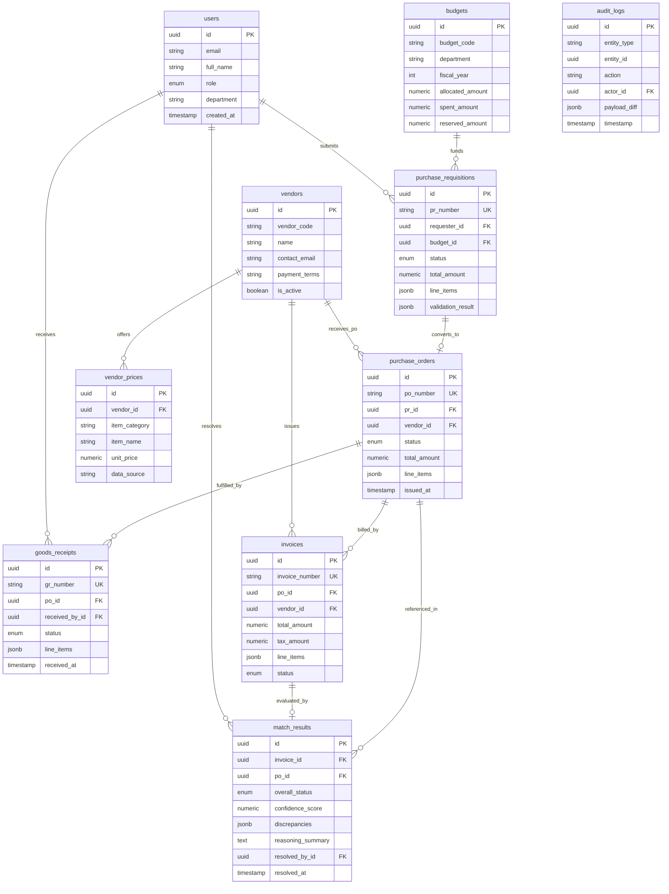

# ProcureAI — Database Architecture & Schema Specification

**Document Version:** 1.0.0  
**Status:** Approved  
**Database Engine:** PostgreSQL 16  
**ORM / Migration Engine:** Async SQLAlchemy 2.0 + Alembic

---

## 1. Overview & Architectural Principles

The ProcureAI data model is designed to support transactional consistency, full auditability across the procurement lifecycle (PR → PO → GR → Invoice), and flexible agent reasoning persistence.

### Core DB Design Principles:
1. **UUID Primary Keys:** All tables use UUIDv4 (`uuid`) for distributed identifier safety and microservice readiness.
2. **Numeric Precision:** All monetary amounts, unit prices, and quantities use `NUMERIC(14, 2)` or `NUMERIC(12, 4)` to prevent floating-point rounding errors.
3. **JSONB for Semi-Structured Data:** Line items, agent validation reports, and discrepancy explainability outputs are stored as `JSONB` for schema flexibility and fast indexing.
4. **Immutable Audit Trails:** State transitions and human overrides are captured in an append-only `audit_logs` table.
5. **Timezone Awareness:** All timestamp columns use `TIMESTAMP WITH TIME ZONE` (`TIMESTAMPTZ`), stored in UTC.

---

## 2. Entity-Relationship Diagram (ERD)



---

## 3. Data Dictionary & Detailed Table Definitions

### 3.1 `users`
Stores user identities and RBAC roles.

| Column | Type | Constraints | Description |
|---|---|---|---|
| `id` | `UUID` | `PRIMARY KEY, DEFAULT gen_random_uuid()` | User ID |
| `email` | `VARCHAR(255)` | `UNIQUE, NOT NULL` | Login email |
| `hashed_password` | `VARCHAR(255)` | `NOT NULL` | Bcrypt hashed password |
| `full_name` | `VARCHAR(100)` | `NOT NULL` | Full name |
| `role` | `VARCHAR(50)` | `NOT NULL` | Role: `REQUESTER`, `PROCUREMENT_OFFICER`, `WAREHOUSE_STAFF`, `AP_CLERK`, `FINANCE_MANAGER` |
| `department` | `VARCHAR(100)` | `NOT NULL` | Department (e.g. "IT", "Operations") |
| `created_at` | `TIMESTAMPTZ` | `NOT NULL, DEFAULT NOW()` | Creation timestamp |

---

### 3.2 `budgets`
Departmental budget allocations per fiscal year.

| Column | Type | Constraints | Description |
|---|---|---|---|
| `id` | `UUID` | `PRIMARY KEY, DEFAULT gen_random_uuid()` | Budget ID |
| `budget_code` | `VARCHAR(50)` | `UNIQUE, NOT NULL` | Budget Code (e.g. "BG-IT-2026") |
| `department` | `VARCHAR(100)` | `NOT NULL` | Department name |
| `fiscal_year` | `INTEGER` | `NOT NULL` | Fiscal year (e.g. 2026) |
| `allocated_amount` | `NUMERIC(14,2)` | `NOT NULL, CHECK (allocated_amount >= 0)` | Total budget limit |
| `spent_amount` | `NUMERIC(14,2)` | `NOT NULL, DEFAULT 0.00` | Actual committed/spent amount |
| `reserved_amount` | `NUMERIC(14,2)` | `NOT NULL, DEFAULT 0.00` | Encumbered/pending PR amount |
| `created_at` | `TIMESTAMPTZ` | `NOT NULL, DEFAULT NOW()` | Record timestamp |

---

### 3.3 `vendors`
Approved vendor master catalog.

| Column | Type | Constraints | Description |
|---|---|---|---|
| `id` | `UUID` | `PRIMARY KEY, DEFAULT gen_random_uuid()` | Vendor ID |
| `vendor_code` | `VARCHAR(50)` | `UNIQUE, NOT NULL` | Vendor Code (e.g. "VEND-001") |
| `name` | `VARCHAR(255)` | `NOT NULL` | Vendor company name |
| `contact_email` | `VARCHAR(255)` | `NOT NULL` | Contact email |
| `payment_terms` | `VARCHAR(50)` | `NOT NULL, DEFAULT 'NET30'` | Standard payment terms |
| `is_active` | `BOOLEAN` | `NOT NULL, DEFAULT TRUE` | Status flag |
| `created_at` | `TIMESTAMPTZ` | `NOT NULL, DEFAULT NOW()` | Record creation time |

---

### 3.4 `vendor_prices`
Internal historical pricing data per vendor & product category.

| Column | Type | Constraints | Description |
|---|---|---|---|
| `id` | `UUID` | `PRIMARY KEY, DEFAULT gen_random_uuid()` | Price entry ID |
| `vendor_id` | `UUID` | `FOREIGN KEY (vendors.id)` | Vendor reference |
| `item_category` | `VARCHAR(100)` | `NOT NULL` | Category (e.g. "Hardware") |
| `item_name` | `VARCHAR(255)` | `NOT NULL` | Item description |
| `unit_price` | `NUMERIC(12,4)` | `NOT NULL, CHECK (unit_price > 0)` | Historical agreed unit price |
| `data_source` | `VARCHAR(50)` | `NOT NULL, DEFAULT 'INTERNAL_HISTORICAL'` | Source: `INTERNAL_HISTORICAL` or `WEB_SEARCH_FALLBACK` |
| `updated_at` | `TIMESTAMPTZ` | `NOT NULL, DEFAULT NOW()` | Price timestamp |

---

### 3.5 `purchase_requisitions` (PR)
Purchase Requests created by Requesters and validated by the Requisition Agent.

| Column | Type | Constraints | Description |
|---|---|---|---|
| `id` | `UUID` | `PRIMARY KEY, DEFAULT gen_random_uuid()` | PR ID |
| `pr_number` | `VARCHAR(50)` | `UNIQUE, NOT NULL` | Formatted PR Code (e.g., `PR-2026-0001`) |
| `requester_id` | `UUID` | `FOREIGN KEY (users.id), NOT NULL` | User who created PR |
| `budget_id` | `UUID` | `FOREIGN KEY (budgets.id), NOT NULL` | Budget code assigned |
| `status` | `VARCHAR(50)` | `NOT NULL` | Status: `DRAFT`, `VALIDATING`, `APPROVAL_PENDING`, `APPROVED`, `REJECTED` |
| `justification` | `TEXT` | `NOT NULL` | Business rationale |
| `total_amount` | `NUMERIC(14,2)` | `NOT NULL` | Sum of line items |
| `line_items` | `JSONB` | `NOT NULL` | List of items `[{item_name, qty, estimated_unit_price, total}]` |
| `validation_result` | `JSONB` | `NULLABLE` | Output from Requisition Agent (anomalies, budget checks) |
| `created_at` | `TIMESTAMPTZ` | `NOT NULL, DEFAULT NOW()` | Creation timestamp |
| `updated_at` | `TIMESTAMPTZ` | `NOT NULL, DEFAULT NOW()` | Last update timestamp |

---

### 3.6 `purchase_orders` (PO)
Official Purchase Orders issued to vendors.

| Column | Type | Constraints | Description |
|---|---|---|---|
| `id` | `UUID` | `PRIMARY KEY, DEFAULT gen_random_uuid()` | PO ID |
| `po_number` | `VARCHAR(50)` | `UNIQUE, NOT NULL` | Formatted PO Code (e.g., `PO-2026-0001`) |
| `pr_id` | `UUID` | `FOREIGN KEY (purchase_requisitions.id), NOT NULL` | Originating PR |
| `vendor_id` | `UUID` | `FOREIGN KEY (vendors.id), NOT NULL` | Selected vendor |
| `status` | `VARCHAR(50)` | `NOT NULL` | Status: `ISSUED`, `PARTIALLY_RECEIVED`, `FULLY_RECEIVED`, `CLOSED`, `CANCELLED` |
| `total_amount` | `NUMERIC(14,2)` | `NOT NULL` | Total PO value |
| `currency` | `VARCHAR(3)` | `NOT NULL, DEFAULT 'USD'` | Currency code |
| `line_items` | `JSONB` | `NOT NULL` | Final ordered items `[{item_id, item_name, qty, unit_price, total}]` |
| `issued_at` | `TIMESTAMPTZ` | `NULLABLE` | PO issuance timestamp |
| `created_at` | `TIMESTAMPTZ` | `NOT NULL, DEFAULT NOW()` | Creation timestamp |

---

### 3.7 `goods_receipts` (GR)
Warehouse receiving entries logged against a PO.

| Column | Type | Constraints | Description |
|---|---|---|---|
| `id` | `UUID` | `PRIMARY KEY, DEFAULT gen_random_uuid()` | GR ID |
| `gr_number` | `VARCHAR(50)` | `UNIQUE, NOT NULL` | Formatted GR Code (e.g., `GR-2026-0001`) |
| `po_id` | `UUID` | `FOREIGN KEY (purchase_orders.id), NOT NULL` | Associated PO |
| `received_by_id` | `UUID` | `FOREIGN KEY (users.id), NOT NULL` | Receiving staff ID |
| `delivery_note_ref` | `VARCHAR(100)` | `NOT NULL` | Vendor delivery slip / tracking # |
| `status` | `VARCHAR(50)` | `NOT NULL` | Status: `MATCHED`, `DISCREPANCY_FLAGGED` |
| `line_items` | `JSONB` | `NOT NULL` | Received items `[{po_line_item_id, qty_received, condition_notes}]` |
| `received_at` | `TIMESTAMPTZ` | `NOT NULL, DEFAULT NOW()` | Delivery receipt timestamp |

---

### 3.8 `invoices`
Vendor invoices submitted for payment processing.

| Column | Type | Constraints | Description |
|---|---|---|---|
| `id` | `UUID` | `PRIMARY KEY, DEFAULT gen_random_uuid()` | Invoice ID |
| `invoice_number` | `VARCHAR(100)` | `NOT NULL` | Vendor's invoice number (e.g., `INV-99231`) |
| `po_id` | `UUID` | `FOREIGN KEY (purchase_orders.id), NOT NULL` | Claimed PO reference |
| `vendor_id` | `UUID` | `FOREIGN KEY (vendors.id), NOT NULL` | Issuing vendor |
| `submitted_by_id` | `UUID` | `FOREIGN KEY (users.id), NOT NULL` | AP clerk who entered invoice |
| `invoice_date` | `DATE` | `NOT NULL` | Date on physical/PDF invoice |
| `total_amount` | `NUMERIC(14,2)` | `NOT NULL` | Invoiced grand total |
| `tax_amount` | `NUMERIC(14,2)` | `NOT NULL, DEFAULT 0.00` | Invoiced tax amount |
| `line_items` | `JSONB` | `NOT NULL` | Billed items `[{description, qty, unit_price, total}]` |
| `status` | `VARCHAR(50)` | `NOT NULL` | Status: `PENDING_MATCH`, `MATCH_CLEAN`, `DISCREPANCY_FLAGGED`, `APPROVED_FOR_PAYMENT`, `REJECTED` |
| `created_at` | `TIMESTAMPTZ` | `NOT NULL, DEFAULT NOW()` | Upload/entry timestamp |

---

### 3.9 `match_results` (3-Way Match Results)
Persisted 3-Way Match evaluation outputs produced by the Invoice Matching Agent.

| Column | Type | Constraints | Description |
|---|---|---|---|
| `id` | `UUID` | `PRIMARY KEY, DEFAULT gen_random_uuid()` | Result ID |
| `invoice_id` | `UUID` | `FOREIGN KEY (invoices.id), UNIQUE, NOT NULL` | Associated Invoice |
| `po_id` | `UUID` | `FOREIGN KEY (purchase_orders.id), NOT NULL` | Referenced PO |
| `overall_status` | `VARCHAR(50)` | `NOT NULL` | `MATCH_CLEAN`, `DISCREPANCY_DETECTED`, `HUMAN_OVERRIDDEN` |
| `confidence_score` | `NUMERIC(4,3)` | `NOT NULL` | Agent confidence (e.g. 0.985) |
| `discrepancies` | `JSONB` | `NOT NULL, DEFAULT '[]'` | Array of discrepancy objects `[{type, severity, field, expected, actual, explanation}]` |
| `reasoning_summary` | `TEXT` | `NOT NULL` | Plain-English explainable summary |
| `resolved_by_id` | `UUID` | `FOREIGN KEY (users.id), NULLABLE` | Manager who resolved discrepancy (if any) |
| `resolution_action` | `VARCHAR(50)` | `NULLABLE` | Action: `FORCE_APPROVE`, `REJECT_INVOICE` |
| `resolved_at` | `TIMESTAMPTZ` | `NULLABLE` | Timestamp of human resolution |
| `created_at` | `TIMESTAMPTZ` | `NOT NULL, DEFAULT NOW()` | Evaluation timestamp |

---

### 3.10 `audit_logs`
Immutable system audit log for security, compliance, and LLM reasoning history.

| Column | Type | Constraints | Description |
|---|---|---|---|
| `id` | `UUID` | `PRIMARY KEY, DEFAULT gen_random_uuid()` | Audit ID |
| `entity_type` | `VARCHAR(50)` | `NOT NULL` | Target entity (`PR`, `PO`, `GR`, `INVOICE`, `MATCH_RESULT`) |
| `entity_id` | `UUID` | `NOT NULL` | Target entity primary key |
| `action` | `VARCHAR(100)` | `NOT NULL` | Action (e.g., `VALIDATED`, `STATE_TRANSITION`, `HUMAN_OVERRIDE`) |
| `actor_id` | `UUID` | `NULLABLE` | User ID or System Agent identifier |
| `payload_diff` | `JSONB` | `NOT NULL` | Before/after snapshot or state payload |
| `timestamp` | `TIMESTAMPTZ` | `NOT NULL, DEFAULT NOW()` | Audit timestamp |

---

## 4. Indexing Strategy & Performance Optimizations

To ensure rapid lookup times during agent 3-way matching and dashboard rendering, the following indexes are defined:

```sql
-- 1. PR Lookups by Requester & Status
CREATE INDEX idx_pr_requester_status ON purchase_requisitions (requester_id, status);

-- 2. PO Lookup by PR and Vendor
CREATE INDEX idx_po_pr_vendor ON purchase_orders (pr_id, vendor_id);

-- 3. GR Lookups by PO
CREATE INDEX idx_gr_po_id ON goods_receipts (po_id);

-- 4. Invoice Lookups by PO and Status
CREATE INDEX idx_invoice_po_status ON invoices (po_id, status);

-- 5. Duplicate Invoice Detection Index (Unique Vendor + Invoice Number)
CREATE UNIQUE INDEX idx_unique_vendor_invoice_number ON invoices (vendor_id, invoice_number);

-- 6. JSONB GIN Indexes for Line Item Searching
CREATE INDEX idx_pr_line_items_gin ON purchase_requisitions USING GIN (line_items);
CREATE INDEX idx_invoice_discrepancies_gin ON match_results USING GIN (discrepancies);

-- 7. Audit Log Indexing by Entity
CREATE INDEX idx_audit_entity ON audit_logs (entity_type, entity_id);
```

---

## 5. Seed Data & Test Fixture Strategy

To enable seamless local development and showcase agentic reasoning capabilities:

1. **Users Seed:** Initial 5 users mapping directly to the 5 RBAC roles.
2. **Budgets Seed:** 3 Departmental budgets (`IT`, `OPERATIONS`, `MARKETING`) with preset spent/allocated balances.
3. **Vendors & Pricing Catalog:** 5 Pre-configured vendors with historical pricing matrices for hardware and office equipment.
4. **Synthetic Edge Case Generator:** A Python seeding script (`backend/app/db/seed_synthetic_cases.py`) that generates pre-built scenarios for test execution:
   * **Case A:** Perfect 3-Way Match.
   * **Case B:** Over-pricing variance (+15% unit price inflation).
   * **Case C:** Partial shipment with full invoice billing (Quantity Mismatch).
   * **Case D:** Unmatched Invoice (No Goods Receipt submitted).
