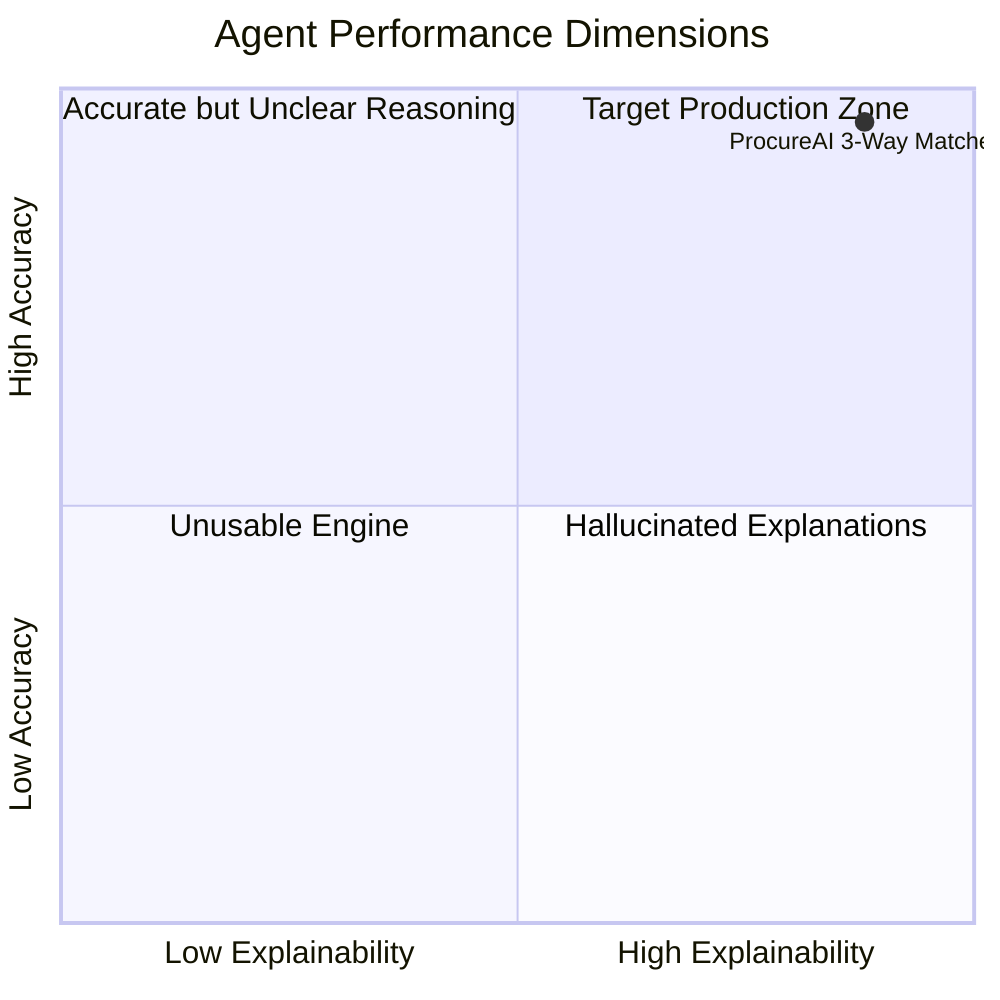
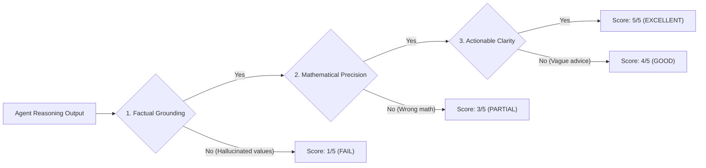

# ProcureAI — Agent Evaluation & Quality Benchmarking Framework

**Document Version:** 1.0.0  
**Status:** Approved  
**Focus Subject:** Invoice Matching Agent (3-Way Reconciliation Engine) & Requisition Agent  
**Testing Framework:** Pytest + Custom Evaluator Harness

---

## 1. Executive Summary & Evaluation Philosophy

In agentic procurement automation, correctness and explainability are paramount. A false negative in 3-way matching (failing to flag an over-billed invoice) results in direct financial leakage, while high false positive rates erode user trust and increase human review overhead.

This document outlines the **Agent Evaluation Framework** for ProcureAI. It defines quantitative benchmarks, synthetic discrepancy injection test fixtures, evaluation metrics (Precision, Recall, False Positive Rate), and the automated evaluation pipeline used to benchmark agent reliability before production deployment.

---

## 2. Evaluation Taxonomy & Metrics

The agentic pipeline is evaluated across four core dimensions:



### 2.1 Quantitative Metrics & Target Thresholds

| Metric | Target | Formula / Definition | Criticality |
|---|---|---|---|
| **Discrepancy Recall** | `≥ 98.0%` | `TP / (TP + FN)` — Percentage of injected discrepancies correctly flagged | **CRITICAL** (Prevents overpayment) |
| **Discrepancy Precision** | `≥ 95.0%` | `TP / (TP + FP)` — Percentage of flagged discrepancies that are genuine anomalies | **HIGH** (Reduces noise) |
| **False Positive Rate (FPR)**| `≤ 2.0%` | `FP / (FP + TN)` — Percentage of clean invoices incorrectly flagged | **HIGH** (Preserves user trust) |
| **Classification Accuracy** | `≥ 96.0%` | Percentage of discrepancies correctly categorized into specific types | **MEDIUM** (Aids routing) |
| **Explainability Grounding**| `≥ 4.5 / 5.0` | Human/Judge score evaluating whether explanation cites real PO/GR numbers | **HIGH** (Auditability) |
| **Mean Evaluation Latency**| `≤ 2.5s` | End-to-end processing time per 3-way match evaluation | **MEDIUM** (UX responsiveness) |

---

## 3. Synthetic Test Suite Matrix (`eval_dataset.json`)

To rigorously benchmark the Invoice Matching Agent, a test suite of **50 synthetic test cases** covers clean matches, single anomalies, compound multi-field discrepancies, and subtle edge cases.

### 3.1 Representative Test Cases

| Case ID | Category | Description | Injected Anomaly | Expected Classification | Expected Severity |
|---|---|---|---|---|---|
| `TC-01` | **Clean Match** | Invoice matches PO & GR exactly | None | `MATCH_CLEAN` | `NONE` |
| `TC-02` | **Price Variance** | Invoice unit price is $175 vs PO $150 (+16.67%) | Unit price inflation | `PRICE_VARIANCE` | `HIGH` |
| `TC-03` | **Price Variance (Tolerance)** | Invoice unit price is $151.50 vs PO $150 (+1.0%) | Minor price shift (< 2% threshold) | `MATCH_CLEAN` | `NONE` |
| `TC-04` | **Quantity Mismatch** | Invoice bills 10 units; PO=10, but GR=6 (Partial delivery) | Billed > Received | `QUANTITY_MISMATCH` | `HIGH` |
| `TC-05` | **Missing GR** | Invoice submitted for PO with 0 recorded Goods Receipts | No GR record exists | `MISSING_GOODS_RECEIPT` | `HIGH` |
| `TC-06` | **Duplicate Invoice** | Vendor submits identical `invoice_number` for same PO twice | Duplicate submission | `DUPLICATE_INVOICE` | `CRITICAL` |
| `TC-07` | **Compound Anomaly** | Price variance (+10%) AND Quantity mismatch (Billed 5 vs GR 3) | Price + Quantity mismatch | `PRICE_VARIANCE`, `QUANTITY_MISMATCH` | `HIGH` |
| `TC-08` | **Tax Mismatch** | Subtotal matches PO, but Tax charged at 15% instead of 10% | Unagreed tax rate | `PRICE_VARIANCE` | `MEDIUM` |

---

## 4. Explainability Scoring Framework

The Invoice Matching Agent must output human-readable reasoning alongside its structured discrepancy classification. Explanations are evaluated using a 3-point criteria rubric:



### Rubric Breakdown:
1. **Factual Grounding (Pass/Fail):** Does the explanation cite actual exact values from the PO, GR, and Invoice records (e.g. `$175.00 vs $150.00`) without hallucinating missing numbers?
2. **Mathematical Precision (Pass/Fail):** Is the variance calculation (e.g. `+16.67%`) mathematically accurate?
3. **Actionable Clarity (Pass/Fail):** Does the explanation provide clear guidance for the AP Clerk / Finance Manager to act without re-investigating manually?

---

## 5. Automated Benchmark Execution (`tests/eval/`)

The benchmark harness is integrated into `pytest` and can be executed locally or in CI/CD pipelines.

### 5.1 Execution Command
```bash
# Run agent benchmark evaluation against the 50 synthetic test cases
uv run pytest tests/eval/test_agent_benchmarks.py -v --json-report --json-report-file=docs/eval_report.json
```

### 5.2 Benchmark Harness Code Structure (`tests/eval/test_agent_benchmarks.py`)

```python
import pytest
from app.agents.sub_agents.invoice_matcher import InvoiceMatchingAgent
from app.schemas.matching import MatchResult

@pytest.mark.asyncio
async def test_invoice_matching_benchmarks(test_case):
    """
    Executes the 3-Way Matcher agent on a synthetic fixture
    and evaluates precision, recall, and structured schema compliance.
    """
    agent = InvoiceMatchingAgent()
    
    # Execute agent on fixture payload
    result: MatchResult = await agent.evaluate_3way_match(
        invoice=test_case["invoice"],
        po=test_case["po"],
        gr_list=test_case["gr_list"]
    )
    
    # Assertion 1: Overall Status Match
    assert result.overall_status == test_case["expected_overall_status"]
    
    # Assertion 2: Discrepancy Classification Precision
    expected_types = {d["type"] for d in test_case["expected_discrepancies"]}
    actual_types = {d.type for d in result.discrepancies}
    assert actual_types == expected_types
    
    # Assertion 3: Confidence Score Threshold
    assert result.confidence_score >= 0.85
```

---

## 6. Guardrails & Safety Mechanisms

To ensure system stability during edge-case processing, the following guardrails are enforced:

1. **Schema Validation Guardrail:** If LLM output fails Pydantic schema validation, the system falls back to a deterministic python rule-based 3-way matcher and logs a schema validation error.
2. **Low Confidence Fallback:** If `confidence_score < 0.85`, the invoice is automatically routed to human review regardless of whether discrepancies were detected.
3. **Deterministic Pre-Check:** Hard checks (such as duplicate `invoice_number` lookups) are executed in pure SQL before calling the LLM agent, saving latency and API cost.
